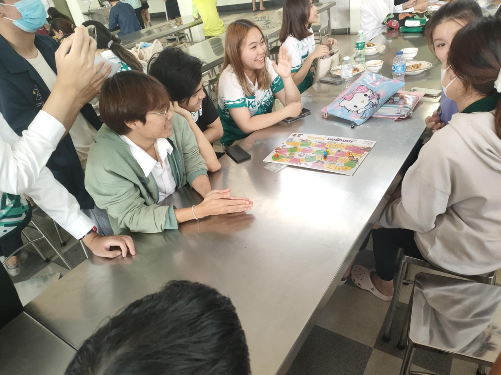
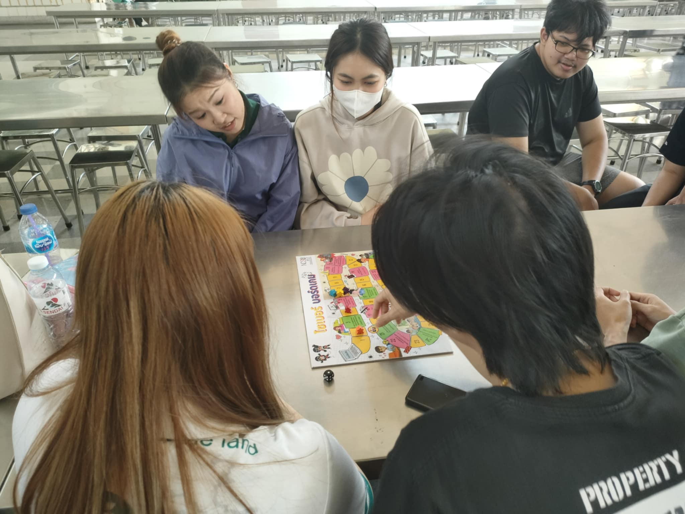
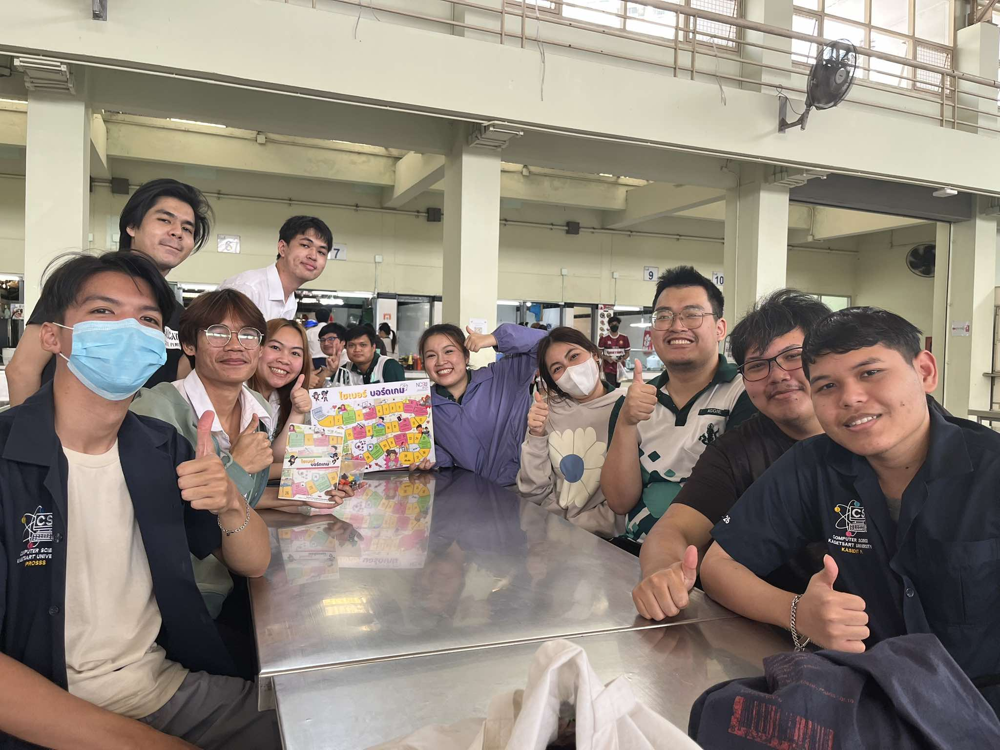

# Cyber Board Game By Kitti Group

## บรรยากาศภายในการทำกิจกรรมการเล่นบอร์ดเกมของสำนักงานคณะกรรมการการรักษาความมั่นคงปลอดภัยไซเบอร์แห่งชาติ(สกมช. หรือ NCSA)
  - กิจกรรมนี้จัดขึ้นเพื่อเสริมสร้างความรู้เกี่ยวกับ Cybersecurity ผ่านการเล่นบอร์ดเกม โดยมีนักศึกษาสาขาวิทยาการคอมพิวเตอร์เข้าร่วมอย่างกระตือรือร้น ตัวบอร์ดเกมถูกออกแบบให้มีความรู้ด้าน Cybersecurity แทรกอยู่ในช่องพิเศษ ทำให้ผู้เล่นได้รับทั้งความสนุกและความรู้ไปพร้อมกัน ผู้เข้าร่วมส่วนใหญ่ให้ความเห็นว่าเป็นครั้งแรกที่ได้สัมผัสกับหัวข้อนี้ และการเล่นเกมนี้ช่วยให้พวกเขาเข้าใจและสนใจในเรื่องความปลอดภัยไซเบอร์มากยิ่งขึ้น บรรยากาศเป็นกันเอง พร้อมการแลกเปลี่ยนมุมมองและความคิดเห็นตลอดช่วงกิจกรรม
  - และสิ่งสำคัญที่สุด ง่ายต่อการเข้าใจ ง่ายต่อการเล่นมากๆ

## วันที่ทำกิจกรรม
  - วันพฤหัสบดี ที่ 23 มกราคม พ.ศ. 2568 (23/1/2025) ที่โรงอาหาร มหาวิทยาลัยเกษตรศาสตร์ วิทยาเขตศรีราชา

## รายละเอียดกิจกรรม
  - กิจกรรมนี้จัดโดยกลุ่ม “Kitti” เป็นนิสิตคณะวิทยาศาสตร์ ศรีราชา สาขาวิทยาการคอมพิวเตอร์ทั้งภาคปกติและภาคพิเศษ
  - กิจกรรมนี้เป็นการเล่นบอร์ดเกมของสำนักงานคณะกรรมการการรักษาความมั่นคงปลอดภัยไซเบอร์แห่งชาติ(สกมช. หรือ NCSA)
  - เป้าหมายของเกม สร้างความเข้าใจพื้นฐานด้านความปลอดภัยไซเบอร์ให้กับกลุ่มเป้าหมาย  เสริมสร้างทักษะในการตัดสินใจเพื่อป้องกันภัยคุกคามไซเบอร์
  - รูปแบบเกม เล่นแบบบันไดงูบอร์ดเกมที่คุ้นเคยมีการทอยลูกเต๋าแล้วก็เดินไปตามช่องตามหน้าลูกเต๋าที่ออก ใครถึงเส้นชัยก่อนชนะ ผู้เล่นจะต้องเดินทางผ่านสถานการณ์ต่างๆ ที่จำลองภัยคุกคามทางไซเบอร์หรือการโจมตีด้วยวิธีต่างๆ ผู้เล่นต้องตัดสินใจแก้ไขปัญหาหรือป้องกันตามสถานการณ์ที่เกมสร้างขึ้น 

## จุดประสงค์
  - เพื่อเสริมสร้างความตระหนักรู้เกี่ยวกับภัยไซเบอร์ให้แก่นักเรียน นักศึกษา และประชาชนทั่วไป

## ผู้เล่น
  - กลุ่มผู้เล่นที่เราได้เข้าไปร่วมเล่นคือ กลุ่มเพื่อนปีที่ 3 คณะวิทยาการจัดการ สาขาบัญชี  
  - เพื่อน 3 คน (คณะวิทยาการจัดการ) Staff 2 คน (คณะวิทยาการคอมพิวเตอร์)

## ภาพกิจกรรมการเล่นบอร์ดเกม

## วิดีโอกิจกรรม

<html lang="en">
<head>
    <meta charset="UTF-8">
    <meta name="viewport" content="width=device-width, initial-scale=1.0">
    <title>Embed YouTube Video</title>
</head>
<body>
    <!-- วิดีโอ YouTube -->
    <iframe 
        width="600" 
        height="315" 
        src="https://www.youtube.com/embed/0B2iD-YyFcw?si=AaUsiJONDK1tXgdk" 
        title="YouTube video player" 
        frameborder="0" 
        allow="accelerometer; autoplay; clipboard-write; encrypted-media; gyroscope; picture-in-picture; web-share" 
        referrerpolicy="strict-origin-when-cross-origin" 
        allowfullscreen>
    </iframe>
</body>
</html>

## ทางกลุ่มผู้จัดทำได้ขออนุญาตผู้ร่วมเล่นกิจกรรมในการถ่ายรูป ถ่ายวิดีโอและการเผยแพร่ลงสื่อ Social Media แล้วเรียบร้อย

สมาชิกกลุ่ม Cyber Board Game 
- [ท่าน JetnipatMark](https://jetnipatmark.github.io/boardgame) 
- [ท่าน Harry Proster](https://prxsss.github.io/boardgame)
- [ท่าน Kitti](https://kitty340822.github.io/boardgame)
- [ท่าน Top](https://top123321.github.io/)
- [ท่าน Kasidit](https://kasidit1647.github.io/)
- [ท่าน Suraphak](https://titigerherb.github.io/)
