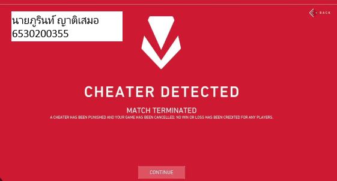

<h1>&#128274; Security Control</h1>

<h2>&#128126; Riot Vanguard</h2>
***Riot vanguard*** คือ ซอฟต์แวร์ป้องกันการโกง (Anti-Cheat Software) ที่พัฒนาโดย Riot Games เพื่อใช้ในเกมของบริษัท เช่น Valorant โดยซอฟต์แวร์นี้ถูกออกแบบมาเพื่อป้องกันการโกงในเกมออนไลน์ โดยการตรวจสอบและบล็อกซอฟต์แวร์ที่ไม่พึงประสงค์ เช่น Cheat Engine, สคริปต์, หรือโปรแกรมที่พยายามดัดแปลงเกมหรือระบบ 

<h2>&#127988; ประเภทของ Security Control</h2>
  - ประเภท (Type of Security Control) : Technical Control
  - ฟังก์ชันของการควบคุม (Control Function) : Preventative Control

<h2>&#128204; คุณสมบัติสำคัญ</h2>
Riot Vanguard ซึ่งเป็นระบบป้องกันการโกงเกม (anti-cheat system) ที่พัฒนาโดย Riot Games จัดอยู่ในประเภท Technical Preventive Control เนื่องจากมีคุณสมบัติในการ: 
<h3>ป้องกันการใช้งานซอฟต์แวร์ที่ไม่ได้รับอนุญาต(Unauthorized Software):</h3>
  - Vanguard ทำหน้าที่ตรวจสอบและป้องกันไม่ให้ผู้เล่นใช้งานโปรแกรมช่วยเล่น เช่น โปรแกรมโกง (cheat tools) หรือสคริปต์ที่ทำลายสมดุลในเกม

<h3>การตรวจสอบเชิงลึก (Deep Inspection):</h3>
  - Vanguard ทำงานในระดับ Kernel (ระดับที่ลึกที่สุดของระบบปฏิบัติการ) เพื่อป้องกันและตรวจจับการดัดแปลงไฟล์เกมหรือการรันโค้ดที่ไม่ปลอดภัยในขณะเล่น

<h3>ควบคุมเชิงป้องกัน (Preventive Action):</h3>
  - เมื่อ Vanguard ตรวจพบพฤติกรรมที่ผิดปกติ เช่น การพยายามเข้าถึงหน่วยความจำหรือการปรับเปลี่ยนระบบไฟล์ที่เกี่ยวข้องกับเกม จะหยุดการทำงานของเกมหรือบล็อกผู้ใช้งานทันที

การบังคับใช้มาตรฐานความปลอดภัย: Vanguard ช่วยให้เกมสามารถรักษาสภาพแวดล้อมที่ยุติธรรมและป้องกันการรบกวนจากการโกงในระยะยาว

<h2>&#127942; สรุป</h2>
Riot Vanguard เป็น Technical Security Control ในรูปแบบของ Preventive Control ที่ออกแบบมาเพื่อป้องกันการโกงในเกม โดยเน้นการตรวจจับ การบล็อก และการตรวจสอบความสมบูรณ์ของระบบในระดับ Kernel เพื่อเพิ่มความปลอดภัยในการเล่นเกมออนไลน์
